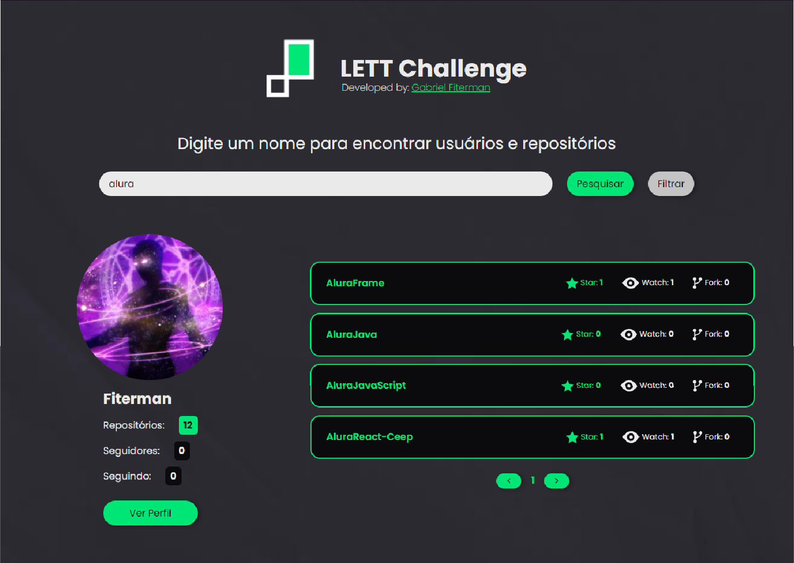

<h1 align="center" style="font-size: 2.5rem;"> Documentação Challenge Lett</h1>

<p align="center">
    
    
    
</p>




## Descrição do projeto
O projeto é uma página web que consiga pesquisar usuários no GitHub e retornar seus repositórios, que também consiga filtrar os repositórios de dado usuário.

Para este projeto foram utilizadas as tecnologias:
- `HTML 5`
- `CSS 3`
- `JavaScript (vanilla)`
- `Figma`
- `Photoshop`
- `GitHub`
- `VsCode`

A pesquisa do usuário pode ser realizada pela tecla enter ou pelo botão requer o termo correto e inteiro. Ex.:

``` input: PurpleWitcher //retorna um resultado válido ```

``` input: PurpleWitch //retorna um erro 404 ```

Já o filtro de repositórios não exige o termo inteiro. Ex.:

``` input: alura //retorna todos os repositórios que contenham "alura" em algum lugar em seu nome ```

## A execução do projeto
A execução do projeto foi simples, com bastante leitura da API bem documentada e algumas pesquisas em pouco tempo já estava com os retornos esperados, então foi necessário fazer o planejamento da interface, o qual pode ser acessado no Figma, as versões para <a href="https://www.figma.com/file/SwpCV4nAH2i3Pn7iO0LEpA/LettChalange?node-id=0%3A1" target="_blank">Desktop</a> e <a href="https://www.figma.com/file/SwpCV4nAH2i3Pn7iO0LEpA/LettChalange?node-id=6%3A687" target="_blank">Mobile</a>.

Consegui sem nenhum problema criar as marcações HTML e CSS exatamente como o planejado, para o CSS utilizei da metodologia B.E.M, que consiste em dividir o CSS em diversos arquivos, optei por separar por seções da página e globais afim de manter uma fácil manutenção e legibilidade. Considerei utilizar o *bootstrap* neste projeto para os grids, mas reconsiderei a necessidade então o fiz utilizando apenas flexBox.

Quanto à lógica utilizada nos scripts, já conseguindo capturar o retono *JSON* da API, não posso dizer que foi completamente tranquila mas também não enfrentei grandes dificuldades, por exemplo lidar com a paginação, acabei optando por fazer outra pesquisa passando diretamente na requisição a página específca que gostaria de exibir. Também me preocupei com alguns detalhes na melhoria da experiência do usuário, como o ```focus``` no input, tratativa para permitir o usuário errar, retorno ao top na paginação... Outro ponto que considero importante quanto ao código foi a separação de pesquisa e filtro, que compartilham apenas o mesmo ```input``` de pesquisa. Pois tanto sua paginação, funções de pesquisa e até mesmo estrutura HTML e CSS precisaram ser separados em minha lógica. Mais detalhes quanto ao código podem ser encontrados <a href="https://github.com/PurpleWitcher/ChallengeLett/blob/7fb0e9e018f250b5465103f41b1b2977f91a5501/assets/scripts/index.js">diretamente no código</a>, que está devidamente documentado.

## Funcionalidades
- :heavy_check_mark: `Versões`: Mobile e Desktop;
- :heavy_check_mark: `Pesquisa`: de usuários e seus repositórios;
- :heavy_check_mark: `Exibição de repositórios organizados`: por data de criação;
- :heavy_check_mark: `Exibição máxima`: de 50 repositórios;
- :heavy_check_mark: `Paginação`: de repositórios e repositórios filtrados;
- :heavy_check_mark: `Filtro de repositórios`: Pesquisados pelo nome do repositório, a pesquisa pode ser feita utilizando uma cadeia de caracteres que contenha no nome do repositório;
- :heavy_check_mark: `Exibição de informações`: tanto para o perfil do usuário quanto para os repositórios.

## Acessos ao projeto
- <a href="https://PurpleWitcher.github.io/ChallengeLett" target="_blank">Projeto Challenge Lett</a>
- <a href="https://github.com/PurpleWitcher/ChallengeLett" target="_blank">Código Fonte</a>
- <a href="https://www.figma.com/proto/SwpCV4nAH2i3Pn7iO0LEpA/LettChalange?node-id=6%3A236&scaling=scale-down-width&page-id=0%3A1&starting-point-node-id=6%3A236" target="_blank">Planejamento de Interface - Desktop</a>
- <a href="https://www.figma.com/proto/SwpCV4nAH2i3Pn7iO0LEpA/LettChalange?node-id=6%3A1994&scaling=min-zoom&page-id=6%3A687" target="_blank">Planejamento de Interface - Mobile</a>

<h1 align="center" style="font-size: 2.5rem;"> Muito Obrigado!</h1>